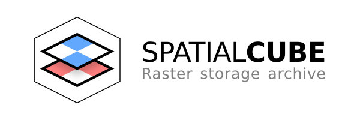
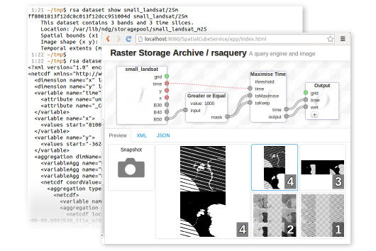

# Raster Storage Archive

The Raster Storage Archive (RSA) is a storage and distribution platform for large geospatial raster datasets.  Datasets can have multiple bands and a temporal component.

Datasets are imported into the RSA via the command line interface or the Web services. The RSA processes the data into manageable files sharing a common projection and alignment. It also merges incoming data with existing datasets as required. RSA simply manages the uploaded data; third party tools can always access the stored images from the file system and read meta-data from the database directly.

One of the fundamental concepts behind RSA is the *data cube*, which is essentially a multi-dimensional image. The RSA supports data cubes with *x* and *y* axes for spatially-varying data and a *time* axis for temporally-varying data. The data cube can contain any number of bands, which are analogous to colour channels in common image formats. The RSA can export sections of the data cube, and can perform spatio-temporal queries on the data with its programmable query engine.

The RSA has a Java API, and two user interfaces:
 
 * [rsacli](doc/rsacli_tutorial.md) - The command line interface, great for administration and automation.
 * [spatialcubeservice](doc/spatialcubeservice.md) - Web services, and a graphical interface for the query engine.

## Installation

 * [Using Vagrant](doc/vagrant_install.md) - Automatically build RSA and its environment using Puppet/Vagrant.
 * [Manual Install](doc/manual_install.md) - Install RSA and its dependencies from scratch on Debian/Ubuntu or Centos/RedHat. This is the path most developers should choose.
 * [Deployment](doc/deploy.md) - How to deploy spatialcubeservice on Tomcat6

## License & Acknowledgements

Copyright 2013 [CRCSI][1] - Cooperative Research Centre for Spatial Information.

The RSA is free software: you can redistribute it and/or modify it under the terms of the GNU General Public Licence as published by the Free Software Foundation, either version 3 of the Licence, or (at your option) any later version. See [LICENCE.txt](LICENSE.txt).

The RSA is distributed in the hope that it will be useful, but WITHOUT ANY WARRANTY; without even the implied warranty of MERCHANTABILITY or FITNESS FOR A PARTICULAR PURPOSE. See the GNU General Public License for more details.

The RSA was developed by VPAC under the [Unlocking the Landsat Archive (ULA)][2] project as funded by the Australian Space Research Program (ASRP).

[1]: http://www.crcsi.com.au/
[2]: http://www.space.gov.au/AustralianSpaceResearchProgram/ProjectFactsheetspage/Pages/UnlockingtheLANDSATArchiveforFutureChallenges.aspx

