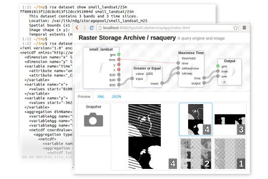

# Raster Storage Archive

The Raster Storage Archive (RSA) is a platform built to store and distribute large geospatial raster datasets.  Datasets can have multiple bands and a temporal component.

Datasets are imported into the RSA via the command line interface or web-services. it will process these uploaded datasets into manageable sized files sharing a common projection and alignment. It will also handle the merging process with existing geospatial data. RSA simply manages the uploaded data; third party tools can always access the stored geospatial from RSARSA hierarchical file system and read meta-data from the database directly.

One of the fundamental concepts behind RSA is the *Data Cube*. The RSA can export a *Data Cube* given appropriate spatial and temporal extents.

The RSA provides an easily extensible method to perform complex spatial-temporal queries through the query engine.

## Downloads

The latest version of the RSA can be found [here](https://github.com/VPAC/rsa/downloads).

To contribute, file bug reports or issues, please visit RSA [GitHub repository](https://github.com/VPAC/rsa).

## Installation

* [Using Vagrant](doc/VAGRANT_INSTALL.md) - How to automatically build RSA and its environtment using Vagrant
* [Manual Install](doc/MANUAL_INSTALL.md) - How to install RSA and its dependencies from scratch on Debian/Ubuntu or Centos/RedHat
 
## Basic Usage

The core functionalities/capabilities can be easily accessed via:
 
* `rsacli` - the RSA command line interface 
* `spatialcubeservice` - the RSA web services and its query UI

####`rsacli`

Stands for RSA command line client.  It is developed to facilitate quick and easy usage on the command line.  It is specially optimised for frequent usage on the command line.

The [tutorial](doc/TUTORIAL.md)
has a detailed walk-through of all usage, but here are the common usage:

    $ rsa -h 									# see a complete list of usage

    $ rsa dataset list 							# list all available datasets
    
    $ rsa dataset show [IDENTIFIER] 			# show all details on the dataset

    $ rsa dataset create <NAME> <RESOLUTION> 	# create a new dataset as specified

    $ rsa band list <DATASET_ID> 				# list all the bands on the dataset

    $ rsa band create <DATASET_ID> <BAND_NAME>	# create a new band for the dataset

    $ rsa timeslice list <DATASET_ID> 			# list all the timeslices on the dataset

    $ rsa timeslice create <DATASET_ID> <DATE>	# create a new timeslice for the dataset
    
    $ rsa data import <TIMESLICE_ID> <BAND_ID> <FILE> # import data into the timeslice & band
    
    $ rsa data export <DATASET_ID>				# export the dataset

    $ rsa data query <QUERY_DEF_FILE>			# run a query as defined in QUERY_DEF_FILE

Bash completion is available for some RSA commands.  To enable it, run:

    $ . _rsacli_bash_completion.sh
    
from the rsacli directory.

### `spatialcubeservice`

* For how to access RSA via web services, use this [spatialcubeservice RESTful API](doc/spatialcubeservice_RESTful_API.pdf).
* For how to perform query via web UI, see this [Query UI demonstration](youtube.com/rsa/query_ui_2.wmv).

## Configuration

Open a sample of [rsa.xml](src/storagemanager/config/rsa.xml.SAMPLE) to see how RSA can be configured.

## Documentation

See below for details instructions/guides:

 * [Query UI demonstration](youtube.com/rsa/query_ui_2.wmv) - Step by step guide on performing query using query UI
 * [Tutorial](doc/TUTORIAL.md) - Step by step guide on how to use RSA
 * [Vagrant Install](doc/VAGRANT_INSTALL.md) - How to install RSA and its environtment using vagrant 
 * [Manual Install](doc/MANUAL_INSTALL.md) - How to install RSA from scratch on Debian/Ubuntu or Centos/RedHat 
 * [Deployment](doc/DEPLOY.md) - How to deploy `spatialcubeservice` on Tomcat6
 * [Writing Query](doc/QUERY.md) - Simple guide on write query for RSA
 * [THREDDS plugin](doc/PLUGIN.md) - How to enable RSA plugin for allowing access to RSA *Data Cube* on thredds

## Screenshot

## License & Acknowledgements

Copyright (c) 2013 CRCSI - Cooperative Research Centre for Spatial Information.

The RSA is licensed under the GPL v3, please see [LICENSE.txt](LICENSE.txt).

The RSA was developed by VPAC under the Unlocking the Landsat Archive (ULA) project as funded by the Australian Space Research Program (ASRP).
