# Query Engine

Contents:

 1. [Introduction](#introduction)
 1. [High-level Design](#high-level-design)
 1. [Filters](#filters)
 1. [Queries](#queries)
 1. [Architecture](#architecture)
 1. [Design](#design)

## Introduction

A common use case for the RSA is to export a section of the data and perform
some operations on it, such as filtering for pixels that meet certain criteria.
For example:

 - Find all pixels that represent water over a given time period.
 - Find all pixels that represent vegetation above 1000m.

*Rsaquery* is a programmable image processing system that allows the creation of
such queries. The query engine is specialised for the type of data stored in the
RSA. The program allows users to define:

 - *Filters* that transform image data.
 - *Queries* that link filters to specific datasets.

Filters are implemented as Java classes using a special API, and queries are
defined using XML. The program has no dependency on the RSA, so it can be used
to run queries on local files as well.

The query engine can handle images with any number of heterogeneous bands and
(currently) up to 4 dimensions. Optionally, the number of dimensions can be
reduced during processing, e.g. summarising data over time.

Queries in rsaquery are constructed as directed acyclic graphs (DAGs) of
filters, like pipelines or workflows in other applications. An illustration of
a filter pipeline is shown below.

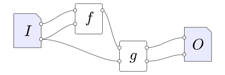

> Filter pipeline with one input (I), one output (O) and two filters (f and g).
> Data flows from left to right.

Rsaquery hides many of the error-prone parts of image processing by
encapsulating pixel iteration. Filters are effectively written as kernel
functions that take coordinates and return pixel values; the query engine will
call the kernel for each pixel in the image and write the result to the output.
The algorithm is summarised below.

    for pixel in output:
	    for band in output:
		    invoke filter for current pixel
		    transfer filtered value of this band to output

A filter with multiple output connections may be invoked several times per
pixel; however, it will not run again unless the pixel coordinates have changed.
All user-defined filter code runs in the invoke filter step.

## Filters

From the perspective of a filter writer, the design of the query engine is quite
simple, as shown below.

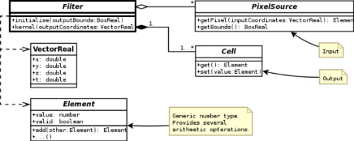

> Filter class diagram.

The main goal of a filter is to populate a dataset; however, it does not iterate
over the output array to do so. Instead, the framework will call the filter's
kernel function once (roughly) for every cell in the output array.

The filter may return values from any source: it could read it from an input,
perform some arithmetic operation on multiple inputs, or generate a value based
only on the coordinates (as a procedural texture). If it reads input from a
`PixelSource`, that input may be a source dataset (e.g. a NetCDF file) or
another filter.

The code of a basic filter is shown below. It simply adds a constant (but
configurable) value to every pixel.

```java
@InheritDimensions(from = "input")
public class AddConst implements Filter {

	public int value = 1;

	public PixelSource input;

	@CellType("input")
	public Cell output;

	@Override
	public void initialise(BoxReal bounds) throws QueryConfigurationException {
	}

	@Override
	public void kernel(VectorReal coords) throws IOException {
		Element<?> currentCell = input.getPixel(coords);
		currentCell.add(value);
		output.set(currentCell);
	}
}
```

The element type is not specified in this filter: it could be a byte, float or
any other basic numeric type. It could even be a vector, in which case the value
would be added to each of the components. The actual type is resolved at runtime
based on the configuration supplied by the user.

### Input, Output and Configuration

A filter should take zero or more inputs, and produce one or more outputs. It
does this by:

 - Reading configuration from primitive fields.
 - Taking input from `PixelSources`, which may be source datasets (e.g. a NetCDF
   file) or other filters.
 - Writing output to `Cells`, which may then be written to a target dataset or
   read by other filters.

`PixelSources` and `Cells` can be seen as circular white sockets in the filter
graph shown above.

A filter should simply declare these fields and use them for I/O. The framework
will assign values to them during query initialisation. The life-cycle of a
`Filter` instance is:

 - *Construction*: Default values for parameters should be assigned now.
 - *Configuration*: The query engine will assign values to the public members as
   required by the query being run. It is up to the user to define how these
   should be instantiated (see below).
 - *Initialisation*: The initialise method is called once after configuration.
   The `PixelSources`, `Cells` and other parameters have already been set, so
   this is where the filter should instantiate private fields that it will use
   during execution.
 - *Execution*: The kernel method is called roughly once per output pixel.
   Ideally, each filter would be called once for every unique output coordinate.
   Often this will be the case; however it is not guaranteed.

Filters have a couple of properties that may not be obvious from reading their
source: their dimensionality and input/output data types. Often these are
extrinsic to the filter, and are determined at runtime. However, the filter
author must guide the query engine so that they can be determined.

### Dimensionality

The dimensionality of a filter is inherited from one of its inputs. In the
`AddConst` example given above, the input field determines the dimensionality
as specified by the `@InheritDimensions` annotation. For example, if input is a
3D dataset, the filter will be expected to produce 3D output - so the coords
argument of the kernel method will be of rank 3.

Some filters change the number of dimensions: for example, it is common for a
filter to take a 3D input that varies in *(time, y, x)* and reduce it to a 2D
output that varies in *(y, x)*. To do that, the filter should be annotated with
`@InheritDimensions(value = "input", reduceBy = 1)`. In that case, the filter
will receive 2D coordinates from the query engine; it is the filter's
responsibility to promote them to 3D for sampling the input pixel source. The
`Reduction` class allows for easy iteration over the outer dimension.

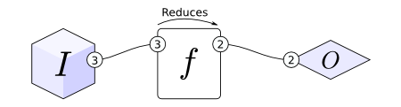

> Illustration of a reduction filter. The numbers indicate how many dimensions
> each socket has.

All outputs of a given filter have the same dimensionality as the filter itself.

### Data Types

Filters in rsaquery are intended to be reused in various queries and on
different input and output datasets. The query engine provides a generic way to
manipulate numeric data to allow filters to operate in a wide variety of
situations. The numeric types are found in the `org.vpac.ndg.query.math`
package; the classes are shown and summarised below.

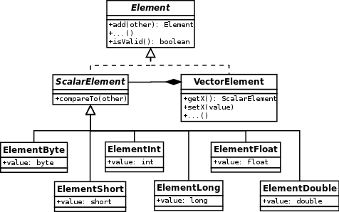

> Data types class diagram.

 - `Element`: This is the most generic data type, and the super type of all other numerics. It supports all basic arithmetic operations such as add and multiply, and bounding operations such as finding the minimum and maximum of two values.

    In addition to storing a numeric value, the Element type has the concept of validity, which is a basic kind of metadata. An element will be tainted (marked as invalid) if it is read from a nodata pixel from the source image, or if an arithmetic operation failed (e.g. divide by zero). The taint is optionally passed to other elements through arithmetic operations. For example, adding one to an invalid element results in an invalid element. When writing to the output, invalid elements will be recorded using the nodata value declared for the target band (which is specified using the `_FillValue` or `valid_range` attributes in NetCDF).

 - `ScalarElement`: Like `Element`, but has a natural ordering and so may be compared with other numbers. Scalar elements can be converted to primitive types.
 - `VectorElement`: A heterogeneous collection of `ScalarElements`. It can be used to perform arithmetic on multiple values, e.g. the add method performs component-wise addition. This type has no natural ordering.

Filters should be written to use the most generic type possible, as this will make them easier to apply to different datasets. If the filter needs to use a specific numeric type (e.g. float), the *element* type should be converted into float instead of using the primitive `float` type - this ensures nodata values are preserved, and allows vectors to be used if the user requires them. The correct way to coerce values is as follows:

```java
Element<?> val = input.getPrototype().asFloat();
val.set(input.getPixel(coords));
```

For speed, the first line should actually be done in the filter's `initialise` method, with `val` stored as a field in the class.

Output fields may be explicitly declared as scalar or vector by using the `CellScalar` and `CellVector` classes. The numeric type can either be inherited from the inputs, or specified by the filter. This is done by placing the `@CellType` annotation above a `Cell` field. If the value of that annotation is a primitive type, e.g. "float", then the cell with have that type. Otherwise, its type will be inherited from an input field with the same name. For example:

```java
@CellType("input")
@CellType("input,float")
@CellType(value = "input", as = "float")
```

From top to bottom: inherit type from input field; create a vector type as the concatenation of the type of the input field followed by a float; create a type with the same rank as input (may be scalar or vector), but ensure all components are floats.

The types of pixel sources can not be specified - except that they may be declared as scalar or vector using the `PixelSourceScalar` and `PixelSourceVector` classes.

### Coordinates

Coordinates in rsaquery are embodied by the `VectorReal` class. Like `Element`s, these vectors support basic arithmetic. Unlike `VectorElement`, these are homogeneous collections of floats - a distinction that was made to increase performance and simplify pixel addressing.

Filters operate in a global coordinate system, which is defined as the pixel space of the output dataset.  Where the output has fewer dimensions than the input, the global coordinate system is constructed as though the output has the same number of dimensions. By default, the bounds of the coordinate system will be the union of the bounds of the input datasets, as shown below. However the user can define different bounds when creating a query.

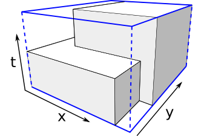

> Coordinate spaces. Grey: inputs. Blue: global. The dashed lines represent a
> dimension (time) that is part of the global coordinate system but not part
> of the output dataset.

The `kernel` method of a filter takes a `VectorReal` as an argument; this object represents the coordinates of the current pixel in the global coordinate system (i.e. the output coordinates). The "first" pixel in a 2D image covers the coordinates *(0.0, 0.0)* to *(1.0, 1.0)*; the first coordinate passed to the filter will be the centre of that pixel at *(0.5, 0.5)*.

#### Component Order

Vector components are specified in NetCDF canonical order, with the most slowly-varying dimension first: *(w, z, y, x)*. Components can also be addressed using letters A-J, with A as the fastest-varying dimension. X, Y, Z and W are synonymous with A, B, C and D, respectively. T (time) is special: it is always the first component. For example, given the vector *(0.0, 1.0, 2.0)*, *x = 2.0*, *y = 1.0*, and *z = t = 0.0*.

#### Bounds

The `PixelSources` (inputs) of a filter are also in the global coordinate system. Where an input dataset has a different origin, scale or projection than the output dataset, the sampler will automatically transform the coordinates when `getPixel` is called. Therefore filters do not need to alter the coordinates when reading from an input - although there are several cases where it is desirable to do so, such as when the filter wishes to warp an image or read from multiple pixels.

Each `PixelSource` has a bounding box that encompasses the useful extents of the data; these are shown as the grey boxes in the figure above. The bounding box can be retrieved using the `getBounds` method. It can be used when traversing input data to avoid needlessly processing non-existent pixels. Note that it is not an error to access a pixel outside the bounds of an image; the behaviour in this case is configurable by the user. By default, the nearest in-bounds pixel will be returned. Also note that, due to the coordinate transforms, the data may not actually fill the box.

#### Vector Swizzling

[Swizzling][swiz] is an operation that transforms a vector by rearranging its components. The operation is specified as a format string, which gets compiled to a `Swizzle` object that can be applied to vectors. Their use is similar to that of regular expressions.

Swizzles has a number of advantages over manual manipulation of the components. They:

 - Are concise and expressive.
 - Are easy to build programmatically, e.g. when the number of components is not known in advance.
 - Can be compiled once and used on different vectors.

[swiz]: http://en.wikipedia.org/wiki/Swizzling_(computer_graphics)

#### Pixel Iterators

The query engine calls filter `kernel` methods once per pixel - so there is often no need for a filter to do its own iteration. However there are cases where it is required; for example, when performing an operation on neighbouring pixels, such as a blur.

Iteration helper classes are available in the `org.vpac.ndg.query.iteration` package. They are:

 - `Reduction`: This allows filters to sample an n+1D input image from nD output coordinates. For example, given an input image with three time coordinates and a *(y, x)* output coordinate of *(5, 4)*, the iterator would generate the input coordinates *(0, 5, 4)*, *(1, 5, 4)*, *(2, 5, 4)*. The filter should initialise it with the bounding box of the region to traverse, and the output coordinates.
 - `Rectangle`: Iterates over coordinates within an nD rectangular window of pixels. This iterator returns a `CoordinatePair` object, which contains the integer index within the window and the real coordinates in the image. The filter should initialise it with the shape of the window, and the output coordinates to centre the window on.
 - `Kernel`: Like `Rectangle`, but returns values from a convolution kernel during iteration. Returns a `KernelPair` object, which contains input image coordinates as well as the corresponding convolution kernel value. The filter should initialise it with the shape of the kernel, an array of kernel values, and the coordinates to centre the window on.

The following code shows how to use a `Reduction` iterator.

```java
public void initialise(BoxReal bounds) throws QueryConfigurationException {
	val = input.getPrototype().copy();
	reduction = new Reduction(input.getBounds());
}

public void kernel(VectorReal coords) throws IOException {
	val.set(0);
	for (VectorReal varcoords : reduction.getIterator(coords)) {
		val.add(input.getPixel(varcoords));
	}
	output.set(val);
}
```

> Excerpt of a reduction filter: finds the sum of the values at the current
> coordinates across the outer dimension.

### Multiple Inputs and Outputs
This section presents a more complicated filter that operates on three different inputs, and produces two outputs. This filter performs a reduction, searching across time to find the pixel with the highest value. When it finds the maximum value, two values are written to the output dataset:

 1. The value of the highest pixel at the current coordinates.
 1. The time that corresponds to that value.

The first half of the class (initialisation) is shown below.

```java
@InheritDimensions(from = "toMaximise", reduceBy = 1)
public class MaximiseForTime implements Filter {

	public PixelSourceScalar toMaximise;
	public PixelSource toKeep;

	@Constraint(dimensions=1)
	public PixelSource intime;

	@CellType("toKeep")
	public Cell output;
	@CellType("intime")
	public Cell outtime;

	Reduction reduction;
	VectorReal tco = VectorReal.createEmpty(1);

	@Override
	public void initialise(BoxReal bounds) throws QueryConfigurationException {
		reduction = new Reduction(toMaximise.getBounds());
	}
```

> Construction and initialisation code for the `MaximiseForTime` filter.

The filter explicitly declares the `toMaximise` field as a scalar input; this is because it needs to compare values from that pixel source. The values in `toKeep` will just be written to the output field, so it doesn't matter what their type is. In practice, these two fields will often be configured to point to the same scalar input band, but there is no need to restrict the filter to that use case.

The intime field is a coordinate axis in the input dataset that represents time. It should be 1D; if not, the `@Constraint` annotation will cause an exception to be thrown during query initialisation. Time values will be written to `outtime` - but `outtime` may not be 1D. This is because the outputs have the same dimensions as the filter itself, and the filter declares itself as a reduction on `toMaximise`. Often, `toMaximise` and `toKeep` will be 3D, `intime` will be 1D and `output` and `outtime` will be 2D.

The second half of the filter is shown below.

```java
	@Override
	public void kernel(VectorReal coords) throws IOException {
		double besttime = 0;
		ScalarElement max = null;

		// Search over all times.
		for (VectorReal varcoords : reduction.getIterator(coords)) {
			ScalarElement val = toMaximise.getScalarPixel(varcoords);
			if (!val.isValid())
				continue;
			if (max == null || val.compareTo(max) > 0) {
				besttime = varcoords.getT();
				max = val;
			}
		}

		// Store result.
		if (max == null) {
			output.unset();
			outtime.unset();
		} else {
			VectorReal co = reduction.getSingle(coords, besttime);
			output.set(toKeep.getPixel(co));
			tco.setT(besttime);
			outtime.set(intime.getPixel(tco));
		}
	}
}
```

> Kernel method of the `MaximiseForTime` filter.


## Queries

A query defines the parameters of each filter and how they relate to each other. A query must define:

 - Zero or more datasets to read input from.
 - One or more datasets to write output to.
 - One or more filters to write to the outputs.

Queries are defined using a memento - this allows the definition to exist without references to open datasets. The structure of a query definition is shown below.

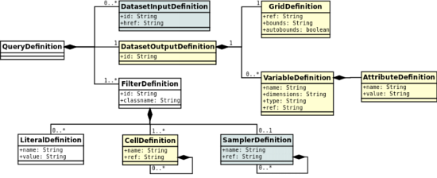

> `QueryDefinition` class diagram.

While a programmatic interface exists, the easiest way to define a query is with XML - the framework will handle de-serialisation.

### Query Example: Maximise for Time

This section presents an example query definition. This follows on from the filter example given in [Multiple Inputs and Outputs](#multiple-inputs-and-outputs) above; see that section for the corresponding filter code in Java.

The goal of this query is to transform a 3D dataset *(time, y, x)* of data into a 2D dataset *(y, x)*. The filter graph is shown below.

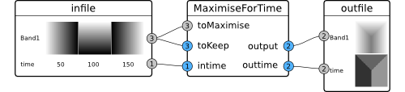

> Filter graph for the maximise query. Left: input dataset, featuring one 2D
> and one 1D band. Middle: filter. Right: output dataset, featuring two 2D
> bands. The grey sockets are scalar; the blue sockets could be any type -
> although in this example, all data is scalar.

The query definition will now be presented as XML.

```xml
<?xml version="1.0" encoding="UTF-8"?>
<query xmlns="http://www.vpac.org/namespaces/rsaquery-0.2">
	<input id="infile" href="../input/abstract.nc" />
```

A single tag is all that is required to define the input dataset. It consists of a URI - in this case the file name - and an ID, so it can be referred to later in the document.

Next, the filter is declared to connect the input dataset to the output.

```xml
	<filter id="max" cls="org.vpac.ndg.query.MaximiseForTime">
		<sampler name="toMaximise" ref="#infile/Band1"  />
		<sampler name="toKeep" ref="#infile/Band1"  />
		<sampler name="intime" ref="#infile/time"  />
	</filter>
</query>
```

Here, the filter has been configured to use the `MaximiseForTime` class presented earlier. The class name must be fully-qualified, and the `.class` file must be on the Java classpath at runtime. The input bands are bound to the `PixelSource` fields by name. Note that `Band1` is connected to both `toMaximise` and `toKeep`.

The `ref` attribute of the sampler tag may refer to any pixel source. In this example the samplers are connected to the input dataset; however, they could instead refer to another filter. For example, a second filter could be added to this query that uses the output of `MaximiseForTime` by declaring a sampler with the attribute `ref="#max/output"` - referring to the first filter's ID. The order in which the filters are specified is not important, but there can be no circular dependencies.

```xml
	<output id="outfile" >
		<grid ref="#infile" />
		<variable name="Band1" ref="#max/output" />
		<variable name="time" ref="#max/outtime" />
	</output>
```

The output dataset inherits its grid (and coordinate system) from the input dataset. Variables are defined using child tags, and connected to the filter using the `ref` attribute. There is no need to declare dimensions; they will be determined automatically by the query engine. In this case, because of the reduction filter, `Band1` will be demoted from 3D to 2D, and `time` will be promoted from 1D to 2D. Coordinate axes `x` and `y` will be created to match the dimensions.

## Architecture

Rsaquery makes heavy use of the [NetCDF-Java][ncj] library for I/O. The architecture is shown in below. The [xstream][xs] library is also used, for deserialisation of `QueryDefinition`s from XML.

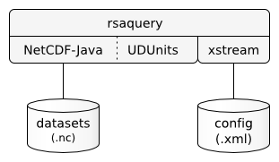

> Query engine technology stack.

The use of NetCDF-Java allows many CDM1 datasets to be read - including NetCDF 3 and 4, provided they are using the classic data model. Rsaquery can be used as an image processing library with any data store that can produce a `NetcdfDataset`. The modified architecture is shown below.

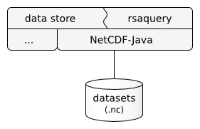

> Rsaquery used as a library.

For example, the Raster Storage Archive (RSA) is a web-based image storage system that has a catalogue in a database. The catalogue allows the RSA to determine the files on disk that make up a dataset. It uses this information to construct virtual datacubes using NetCDF-Java. The datacubes are constructed similarly to NCML datasets, but without the need to store the aggregation on disk.

The datacubes created by the RSA are `NetcdfDataset` objects, which are readily consumed by rsaquery. The following steps are taken when a user asks to run a query:

 1. RSA constructs a `QueryDefinition` object that contains references to datasets in its storage pool.
 1. Rsaquery asks the RSA for the specified datasets via a registered I/O plugin.
 1. The RSA creates datacubes (virtual NCML aggregations) of the underlying NetCDF files using NetCDF-Java.
 1. The datacubes are processed by rsaquery as though they are regular NetCDF files.

[ncj]: http://www.unidata.ucar.edu/software/netcdf-java/index.html
[xs]: http://xstream.codehaus.org/

## Design

Central to the design of the query engine is the way filters receive and write out data. As introduced in section [Input, Output and Configuration](#input,-output-and-configuration), filters read from `PixelSource`s and write to `Cell`s. These two types are actually interfaces with a number of sub-types, as shown in the diagram below. Both types can be either scalar or vector, and `PixelSource`s can fetch their data either from datasets using the `Sampler` classes or from other filters using the `FilteredPixel` classes.

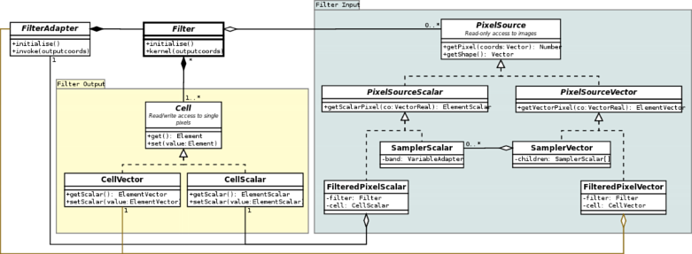

> Class diagram of the filter input and output types.

As can be seen from the diagram, `FilteredPixel`s have a reference to a filter and a cell. When a pixel is asked for, the filtered pixel will first invoke the filter and then read the value from the cell it is bound to.

### Construction

A query is deserialised from a `QueryDefinition` memento - see `Query.setMemento()`. The process for query construction is, in order:

 1. Definition preprocessing.
 1. Create coordinate system.
 1. Open input datasets.
 1. Configure output dataset.
 1. Create and bind filters.

The prominent classes of the construction phase are illustrated below. Each step is detailed in the following sub-sections.

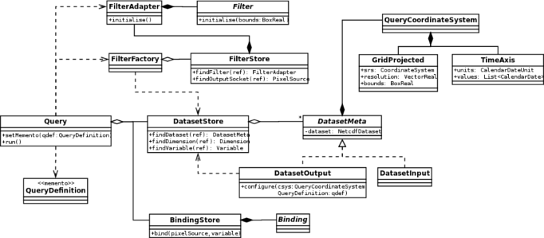

> Class diagram of the dataset input and output types.

#### Definition Preprocessing

The `QueryDefintion` is processed to sort filters into the order required for instantiation: a filter must be constructed before any other filter that refers to it. At this stage variables are expanded too.

#### Create Coordinate System

Adapter (`DatasetInput`) objects are created for the input datasets. The I/O provider (see Figure 13) is asked to fetch the coordinate system of each input. Where possible, the inputs will not actually be opened.

Then, a `QueryCoordinateSystem` object is created to represent the global coordinate system of the query. It is based on the projection of one of the inputs. Its bounds will either be the union of all the input bounds, or some other bounds if specified in the query definition. `Warp` objects are used to transform between coordinate systems when determining the bounds.

Each input dataset is added to the `DatasetStore` to be referred to later.

#### Open Input Datasets

Once the bounds have been determined, the input datasets are opened. The global bounds are transformed to each input's local coordinate system and provided as a hint to the I/O provider to indicate exactly what should be opened. This allows providers that support tiling to optimise which files to include in the aggregation. The RSA is one such provider.

The coordinate system of each input dataset is recalculated after opening, because it may have changed due to the bounds hint.

#### Configure Output Dataset

When creating a new query, the calling application needs to provide an empty `NetcdfFileWriter` dataset to write to. Once the inputs have all been opened and the bounds determined, the query engine will populate the output dataset with metadata based on the specifications in the query definition.

The `DatasetOutputDefinition` contains the definition of a grid and variables. As a first step, the coordinate system is created by copying it from the input dataset specified in the query definition. It is modified a little to update the bounds.

Next the declared variables are dereferenced. For example, if a variable definition was given as:

```xml
<variable name="Band1" ref="#max/output" />
```

The missing parameters would need to be filled in. The data type, nodata value and dimensions are inherited from the filter that it refers to; this information is passed from filter to filter using the `Prototype` class.

```xml
<variable name="Band1" type="float" dimensions="y x" ref="#max/output">
	<attribute name="_FillValue" value="-999.0" />
	<attribute name="long_name" value="Band Number 1" />
</variable>
```

The variables are not actually created in the target file yet, because first the dimensions need to be created. The required dimensions are accumulated during variable dereferencing.

With all the variables declared, they are created and added to the file. Then the header is committed by calling `NetcdfFileWriteable.create()`, after which it is possible to write actual data (as opposed to metadata). Most of the data is written later, during filter execution - but the coordinate variables are populated immediately based on the bounds and coordinate system.

#### Create and Bind Filters

The purpose of this phase is to construct a filter graph. Filters are created in-order by a `FilterFactory`. First, the filter is instantiated according to the class name given in the `FilterDefinition`. Because the `Filter` interface is quite minimal, the instance is wrapped in a `FilterAdapter` for the convenience of the query engine. Then, the literal parameters (constant values) and pixel sources are attached to the filter. These are fields in the filter that have been declared public; they are found and assigned using reflection. The factory keeps a local `FilterStore` to allow inter-filter references to be resolved.

The way pixel source fields are attached depends on what they refer to. If the `ref` field points to a dataset, then a new `Sampler` will be created to read from the band. Otherwise, a `FilteredPixel` will be found and reused.

#### Execution

The basic process of execution is shown in section [High-level Design](#high-level-design) above. That section explains that the filters are executed once for each pixel in the output image. To reduce memory usage, this process is actually split into chunks called tiles based on the output coordinates, as shown below.

    split output image into tile grid
    for tile in tile grid:
	    for each filter binding:
		    resize binding's buffer to match current tile
	    for pixel in tile:
		    for each filter binding:
			    invoke filter (may be no-op)
			    transfer data from filter to buffer
	    for each binding binding:
		    write buffer to output

> Pseudocode for tiled pixel processing.

Most of the implementation of the above algorithm is located in the `Query` class. However the iteration over individual pixels is handled by a `TileProcessor`, which is an interface currently with two implementations: a single-threaded version, and a multithreaded one.

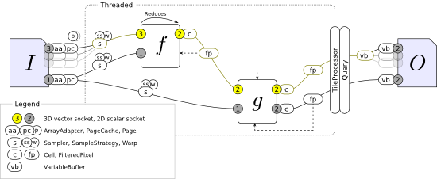

> Filter pipeline diagram, showing the points at which the `TileProcessor` and
> `Query` classes drive processing.

The `TileProcessor` only explicitly requests data from the filters that are directly attached to the output dataset; the other filters are invoked implicitly.

##### Multithreading

The dashed box in the above diagram shows the section of the pipeline that is involved in multithreading. When multithreading is enabled, the object instances in this region are created multiple times; then multiple worker threads invoke the filters and write to the buffers. The buffers are not duplicated; instead, each thread writes to different pixels in the buffer. For example, with three threads the first thread would write to pixels 0, 3, 6, 9, etc. When a tile is fully processed, the worker threads pause while the buffer is written to disk. They resume again when the next tile is ready.

By duplicating most of the filter pipeline, the threads can operate mostly independently. The filters do not need to be written to be thread-safe, as it is a natural property of the design. The only part of the system that needs to be thread-safe is the `PageCache`, because it actually reads the data from the input datasets. Its function is described below.

##### Paged Input

When a filter requests a pixel from a sampler, it transforms the coordinates and fetches the value from the source band. Like the output, the input bands are also split into tiles, but that happens transparently. The process is:

    transform coordinates from global pixel space to projected coordinates
    transform from projected coordinates to local (input dataset) pixel space
    if the coordinates are out of bounds:
	    snap coordinates to the nearest valid location
    transform from pixel space to the equivalent pixel in the current tile
    if the coordinates are out of bounds:
	    read the correct tile (page)
    read the pixel value from the current tile

> Pseudocode for tiled pixel processing.

The process is split across the classes shown below.

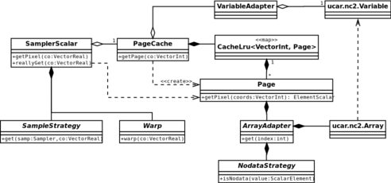

> Class diagram of the paging system used by samplers. The filter only asks for
> pixels from the sampler. Data is ultimately read from the `ucar.nc2.Variable`
> class.

 - The transform to local pixel space is handled by the `Warp` classes. This allows a sampler to use specialised warps for different situations; for example, if the input has the same projection and resolution as the output, a simple offset involving a single vector addition can be used.
 - Coordinate snapping is handled by the `SamplerStrategy` classes. Again, these are configurable. Snapping the coordinates will make the edges of the image appear to smear beyond the bounds of the dataset; this is useful in many situations including blurring. Other strategies could be implemented, e.g. one that returns nodata or a constant value for pixels that are out of bounds.
 - The transformation to the pixel space of the tile is handled by the `Page` class, which itself embodies the tile.
The sampler simply tries to read from the tile. If doing so generates an `IndexOutOfBoundsException`, it is considered to be a page fault. The next page is fetched from the `PageCache`, and then the read is attempted again.
 - The page cache has a least-recently used cache. If the cache already contains a page for the requested coordinates, it is returned (soft page fault). Otherwise, the requested page is read from the `Variable` (band), added to the cache, and returned to the sampler (hard page fault).

Page faults are relatively expensive, but they tend to happen rarely because of the read pattern of the typical filter. By choosing an appropriate tile size, filters transparently benefit from paged memory with little impact on performance.

