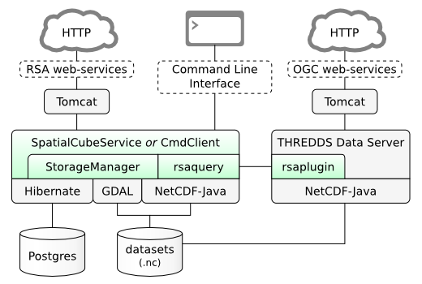
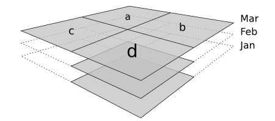

# RSA Design

The Raster Storage Archive (RSA) is a system for storing and processing large
geospatial datasets. This document presents the high-level design of the system.

## Software Stack

The RSA makes use of several libraries. The primary dependencies are shown in
grey in the diagram below; RSA modules are green.

The primary dependencies are:

 * [GDAL][gdal] and [NetCDF-Java][ncj] for processing and transforming data for import and export.
 * [Hibernate][hb] for interacting with the database.
 * [Tomcat][tc] and [Spring][sp] for servicing web requests.

[gdal]: http://gdal.org/
[ncj]: http://www.unidata.ucar.edu/software/netcdf-java/
[hb]: http://www.hibernate.org/
[tc]: http://tomcat.apache.org/
[sp]: http://www.springsource.org/

## Storage Manager

The RSA currently handles data with three dimensions (*time*, *x* and *y*) and
any number of [bands][var]. Data is stored in buckets called *datasets*, which
are a used to logically group the data. For example, one might store datasets
called *Landsat 7*, *Digital Elevation Map*, or *Local Govenment Authorities*.
Datasets have basic metadata associated with them; this is stored in a
relational database. This metadata exists primarily to enhance the processing
capabilities of the RSA - e.g. the bounds of the data are stored to speed up
spatial queries. It is expected that detailed non-raster metadata will be stored
in a separate catalogue such as [GeoNetwork][gn].

Raster data is not stored in the relational database; instead, it is stored as
files in a regular filesystem. This minimises overhead for data extraction, and
allows it to be directly accessed by tools other than the RSA.

Datasets in the RSA can be very large - on the order of several terabytes. It
would be impractical to store a dataset as a single file, because merging and
updating data might require very large portions of the file to be rewritten.
Therefore the RSA automatically splits data into chunks called *tiles* during
import.

The data is tiled both spatially and temporally. By default, tiles have a shape
of *(1 5000 5000)* pixels, i.e. each tile represents a single time slice and
5000 cells in *x* and *y*. Each band is also stored in a separate file. In
addition to making management of the data easier for the RSA, it also means that
a dataset may be sparse: it is OK for data to be missing for a certain time,
place and band - in which case the file will simply not be present in the
storage pool. In the example above, there are three time slice and four tiles -
but only tile *d* exists for all three time slices.

The directory structure for a small dataset is shown below. This dataset
contains three time slices (the directories), three bands (B30, B40 and B50) and
two spatial tiles (28, 20 and 29, 20).

    /var/lib/ndg/storagepool/small_landsat_m25/
    |-- 2010-01-16T00-00-00.000
    |   |-- B30_tile_x28_y20.nc
    |   |-- B30_tile_x29_y20.nc
    |   |-- B40_tile_x28_y20.nc
    |   |-- B40_tile_x29_y20.nc
    |   |-- B50_tile_x28_y20.nc
    |   `-- B50_tile_x29_y20.nc
    |-- 2010-02-01T00-00-00.000
    |   |-- B30_tile_x28_y20.nc
    |   |-- B30_tile_x29_y20.nc
    |   |-- B40_tile_x28_y20.nc
    |   |-- B40_tile_x29_y20.nc
    |   |-- B50_tile_x28_y20.nc
    |   `-- B50_tile_x29_y20.nc
    |-- 2010-05-08T00-00-00.000
    |   |-- B30_tile_x28_y20.nc
    |   |-- B30_tile_x29_y20.nc
    |   |-- B40_tile_x28_y20.nc
    |   |-- B40_tile_x29_y20.nc
    |   |-- B50_tile_x28_y20.nc
    |   `-- B50_tile_x29_y20.nc
    |-- B30_blank.nc
    |-- B40_blank.nc
    |-- B50_blank.nc
    `-- preview.nc

The tiled storage of raster data is encapsulated by the RSA. A user may access
the data in three ways:

 1. Export a section of data as a data cube. The data is mosaiced spatially,
    resulting in one `.nc` file per time slice and band. These are then
    aggregated through time and band using NCML, and returned to the user as a
    `.zip` file. Optionally, the data can be reprojected during the mosaicing.
 1. Query the data using the query engine. The query engine allows custom image
    processing operations during export; in the simplest case a query can simply
    copy data to an output data cube. This results in a single `.nc` file that
    contains all the requested dimensions and bands.
 1. The RSA can create an NCML file that represents a view of the data in the
    storage pool. By opening the NCML file in a viewer such as [ToolsUI][tui],
    live data in the RSA may be viewed without performing an export. The NCML
    file can also be opened by non-viewing software to analyse the data as a
    contiguous image, i.e. without concern for tiling. Like the other access
    options, the files included in the NCML can be restricted by time, space and
    band to avoid the need to load the entire dataset.

### Benchmarking

Other designs for the storage system were considered, e.g. storing all the data
for each dataset in a single file. While this would complicate the code of the
RSA, it may have given a performance boost. Tests were run for data extraction
with various levels of tiling:

* 0: Monolithic - all data in one file.
* 1: Aggregated by time.
* 2: Aggregated by time and band.
* 3: Aggregated by time, band and space.

It was found that, regardless of the volume of data being extracted, each level
of aggregation added a constant overhead. For a 4x1024x1024 chunk of data, the
3-level aggregation added an overhead of 18% for the initial run (no file
system caching) and 9% for subsequent runs compared to 0-level aggregation. This
was deemed to be small enough to justify the use of 3-level aggregation in the
RSA.

[var]: http://www.unidata.ucar.edu/software/netcdf/docs/netcdf/Variables.html
[gn]: http://geonetwork-opensource.org/
[tui]: http://www.unidata.ucar.edu/software/netcdf-java/documentation.htm

